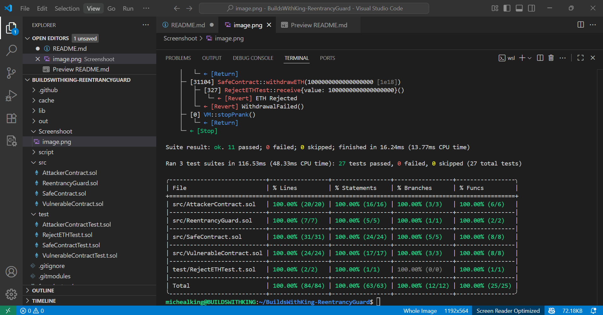

# 🛡 BuildsWithKing - Reentrancy Guard

A Solidity project demonstrating *Reentrancy vulnerabilities* and their mitigation using my custom-built *ReentrancyGuard*.  
This repository contains:

- A *vulnerable contract* (susceptible to reentrancy attacks)
- An *attacker contract* that exploits the vulnerability
- A *safe contract* using my custom-built reentrancy guard
- *Tests* simulating attacks, failed withdrawals, and secure ETH transfers

> Created between *24–28 Aug, 2025* by Michealking (@BuildsWithKing)[]

---

## 📂 Project Structure

```
BuildsWithKing-ReentrancyGuard/
│   ├──src/
|        ├── VulnerableContract.sol      # Contract without protection (reentrancy exploitable)
|        ├── SafeContract.sol          # Same logic, but protected with custom ReentrancyGuard
|        ├── ReentrancyGuard.sol         # Custom guard implementation (nonReentrant modifier)
|        ├── AttackerContract.sol        # Exploits the vulnerable contract
|     
|   ├──test/
|        ├── RejectETHTest.sol           # Rejects ETH to simulate WithdrawalFailed scenario
|        ├── VulnerableContractTest.t.sol # Foundry tests for vulnerabilities & exploits
|        ├── SafeContractTest.t.sol    # Foundry tests for secure contract
|        ├── AttackerContractTest.t.sol # Foundry tests for attacker contract. 
| 
└── README.md                   # Project documentation

```

---

## ✨ Features

- *Vulnerable Contract* – demonstrates unsafe withdraw pattern (external call before updating state)
- *Attacker Contract* – recursively drains funds via reentrancy exploit
- *Safe Contract* – fixes the issue using a *nonReentrant modifier*
- *RejectETHTest* – simulates failure when a receiver rejects ETH
- *Foundry Tests* – covers both attack and defense scenarios

---

## 🔬 Security Lessons

1. *Checks-Effects-Interactions Pattern* – always update state before making external calls
2. *Reentrancy Guard* – use a locking mechanism (modifier) to prevent recursive calls
3. *Test Adversarially* – simulate attacker contracts and failing receivers to validate safety
4. *Expect Events in Tests* – verify state transitions with vm.expectEmit in Foundry

## 🔥Coverage 100%



## 🎥 How Reentrancy Attack Works

Check out the demo video explaining how the *vulnerable contract is exploited* and how the *reentrancy guard protects the contract when added*:

<video controls src="Screenshoot and Video/BUILDSWITHKING_REENTRANCYGUARD VIDEO.mp4" title="How Reentrancy Attack Works"></video>
---

## 🛠 Tools Used

- Solidity ^0.8.30  
- VS Code + [Remix IDE](https://remix.ethereum.org/)
- Git + GitHub (SSH)  
- Foundry (forge test / forge coverage).
  

## 🚀 Getting Started

### Prerequisites

- [Foundry](https://book.getfoundry.sh/) installed (forge, cast)

### Installation

```bash
git clone https://github.com/BuildsWithKing/buildswithking-reentrancyguard.git
cd buildswithking-reentrancyguard
forge install
```

Running Tests and coverage. 
```
forge test -vv
forge coverage
```

---

## 🧪 Example Test Cases

✅ Deposit & withdraw funds from vulnerable contract

⚠ Exploit reentrancy with AttackerContract

✅ Withdraw safely from safe contract (attack prevented)

❌ Simulate withdrawal failure using RejectETHTest


---

## 📜 License

This project is licensed under the MIT License

---

## 👨‍💻 Author

Michealking [@BuildsWithKing](https://github.com/BuildsWithKing)

Project Date: 24th–28th Aug, 2025

---